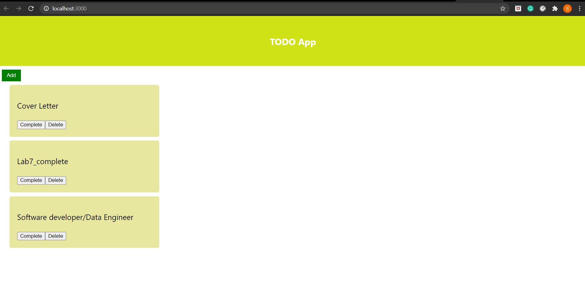
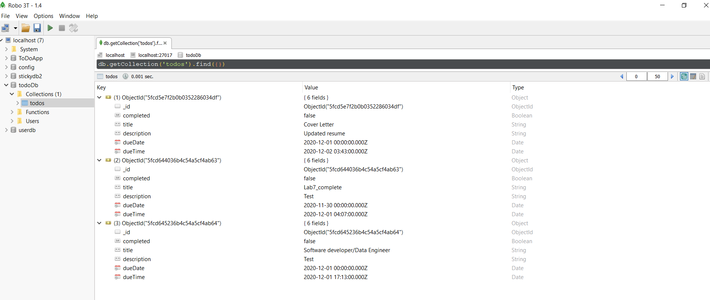

## Implementing simple React application for Todo App.





### Description

1. This project was created with Create React App

2. Using Todo Resource, user can do the following functions.

 * Fetch all existing todo items using REST API
 * Click on todo item  and able to see its detailed view.
 * User can open add a new todo item view by clicking on the add button.
 * Add a todo item by entering title, description, due date and time.
 * Mark a todo item as complete

### Technologies

1. Nodejs
2. Express
3. Mongoose
4. MongoDB
5. React

### Steps to run the Project

1. Using git clone, copy the code to your directory.
```bash
git clone https://github.com/neu-mis-info6150-fall-2020/assignment-9-sagarshah95
```

2. Open folder todo-server and run the below command to start server
```bash
npm run server
```

3. Open folder todoapp and run following command to run the app
```bash
npm run start
```

4. Access the server at http://localhost:3001/ and app at http://localhost:3000


### Contributing
Pull requests are welcome. For major changes, please open an issue first to discuss what you would like to change.

Please make sure to update tests as appropriate.

